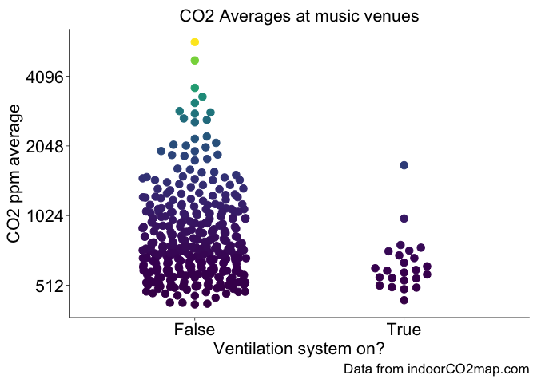
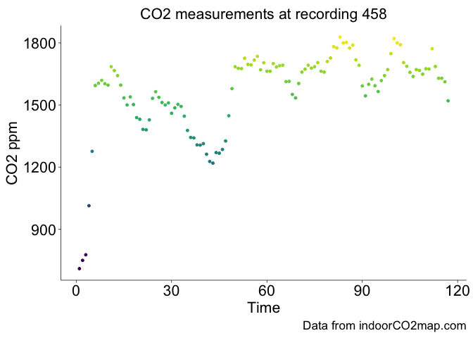

<!-- README.md is generated from README.Rmd. Please edit that file -->

# autocruller

<!-- badges: start -->

[](https://lifecycle.r-lib.org/articles/stages.html#experimental)
[](https://CRAN.R-project.org/package=autocruller)
[](https://github.com/samherniman/autocruller/actions/workflows/R-CMD-check.yaml)
<!-- badges: end -->

Auto **ˈɔːtəʊ** - [short for automobile, a
car](https://en.wiktionary.org/wiki/auto)  
Cruller **ˈkrʌl ər** [a pastry roll or
bun](https://en.wiktionary.org/wiki/cruller)

autocruller - car bun

{autocruller} allows one to download, manipulate and visualize
CO<sup>2</sup> readings from the
[indoorco2map.com](https://indoorco2map.com/?lat=51.16570&lng=10.45150&zoom=6.00)
dataset.

Please support that project by contributing CO<sup>2</sup> readings,
reporting bugs, telling your friends and financially supporting it (if
you feel inclined).

## Carbon Dioxide is important, Y’all

There is a well documented relationship between indoor levels of
CO<sup>2</sup> and the amount of ventilation in indoor environments.
Buildings with high indoor levels of CO<sup>2</sup> have poor
ventilation and are therefore more likely to be vectors of airborne
diseases (like [COVID-19](https://basiccovidfacts.com/), Measles, and
Flu) and to trap indoor pollutants.

## Never used R before?

Read
[this](https://rstudio-education.github.io/hopr/starting.html#starting)

## Installation

You can install the development version of autocruller from
[GitHub](https://github.com/) with:

``` r
# install.packages("pak")
pak::pak("samherniman/autocruller")
```

## Get started

Download the latest data with `ac_get_co2()`

``` r
library(autocruller)

ac_df <- ac_get_co2("download")
```

That will give you a dataframe with all the current CO<sup>2</sup>
measurements.

``` r
dplyr::glimpse(ac_df)
#> Rows: 11,250
#> Columns: 22
#> $ obs_number         <int> 1, 2, 3, 4, 5, 6, 7, 8, 9, 10, 11, 12, 13, 14, 15, …
#> $ nwrtype            <chr> "n", "n", "n", "w", "n", "n", "n", "w", "n", "w", "…
#> $ nwrID              <dbl> 4436021034, 386028187, 1706619258, 248962888, 42717…
#> $ name               <chr> "Konsum", "Konsum Leipzig", "Konsum", "REWE", "Kons…
#> $ countryID          <chr> "DEU", "DEU", "DEU", "DEU", "DEU", "DEU", "DEU", "D…
#> $ countryName        <chr> "Germany", "Germany", "Germany", "Germany", "German…
#> $ nuts3ID            <chr> "DED51", "DED51", "DED52", "DED51", "DED51", "DED51…
#> $ nuts3Name          <chr> "Leipzig, Kreisfreie Stadt", "Leipzig, Kreisfreie S…
#> $ osmKey             <chr> "shop", "shop", "shop", "shop", "shop", "amenity", …
#> $ osmTag             <chr> "supermarket", "supermarket", "supermarket", "super…
#> $ brand              <chr> "Konsum Leipzig", "Konsum Leipzig", "Konsum Leipzig…
#> $ startOfMeasurement <chr> "2024-05-15T17:10:19.811", "2024-05-16T10:27:41.828…
#> $ windowsOpen        <chr> "False", "False", "True", "False", "False", "True",…
#> $ ventilationSystem  <chr> "True", "True", "True", "True", "True", "False", "T…
#> $ customNotes        <chr> "", "", "", "", "", "", "", "", "", "", "offenes kl…
#> $ co2readings        <list> <544, 573, 547, 533, 595, 601>, <680, 672, 640, 66…
#> $ offset             <int> 0, 0, 0, 0, 0, 0, 0, 0, 0, 0, 0, 0, 0, 0, 0, 0, 0, …
#> $ interval           <int> 1, 1, 1, 1, 1, 1, 1, 1, 1, 1, 1, 1, 1, 1, 1, 1, 1, …
#> $ co2readingsAvg     <int> 566, 661, 936, 1576, 724, 486, 726, 1475, 534, 1242…
#> $ date               <dttm> 2024-05-15 17:10:19, 2024-05-16 10:27:41, 2024-05-…
#> $ day                <date> 2024-05-15, 2024-05-16, 2024-05-17, 2024-04-15, 20…
#> $ geometry           <POINT [°]> POINT (12.36603 51.34016), POINT (12.39733 51…
```

If you want the co2readingss to be in long format, you can do this:

``` r
ac_df_long <- ac_unnest_longer(ac_df)
```

## Make a graph

``` r
pak::pak("tidyplots")
```

You can compare averages with the wide format data

``` r
library(tidyplots)

types_c <- c(
  "arts_centre", "events_centre", "cinema",
  "social_facility", "theatre", "music_venue",
  "music", "nightclub", "social_centre", "concert_hall"
)
ac_df |>
  dplyr::filter(osmTag %in% types_c) |>
  tidyplot(
    x = ventilationSystem,
    y = co2readingsAvg,
    color = co2readingsAvg
  ) |>
  add_data_points_beeswarm(size = 3) |>
  adjust_y_axis(transform = "log2") |>
  adjust_size(width = NA, height = NA, unit = "cm") |>
  adjust_font(fontsize = 16) |>
  adjust_x_axis_title("Ventilation system on?") |>
  adjust_y_axis_title("CO2 ppm average") |>
  remove_legend() |>
  adjust_title("CO2 Averages at music venues") |>
  adjust_caption("Data from indoorCO2map.com")
```



And track things over time with the long format data

``` r
ac_df_long |>
  dplyr::filter(obs_number == 458) |>
  tidyplot(
    x = reading_index,
    y = co2readings,
    color = co2readings
  ) |>
  add_data_points() |>
  adjust_size(width = NA, height = NA, unit = "cm") |>
  adjust_font(fontsize = 16) |>
  adjust_x_axis_title("Time") |>
  adjust_y_axis_title("CO2 ppm") |>
  remove_legend() |>
  adjust_title("CO2 measurements at recording 458") |>
  adjust_caption("Data from indoorCO2map.com")
```


